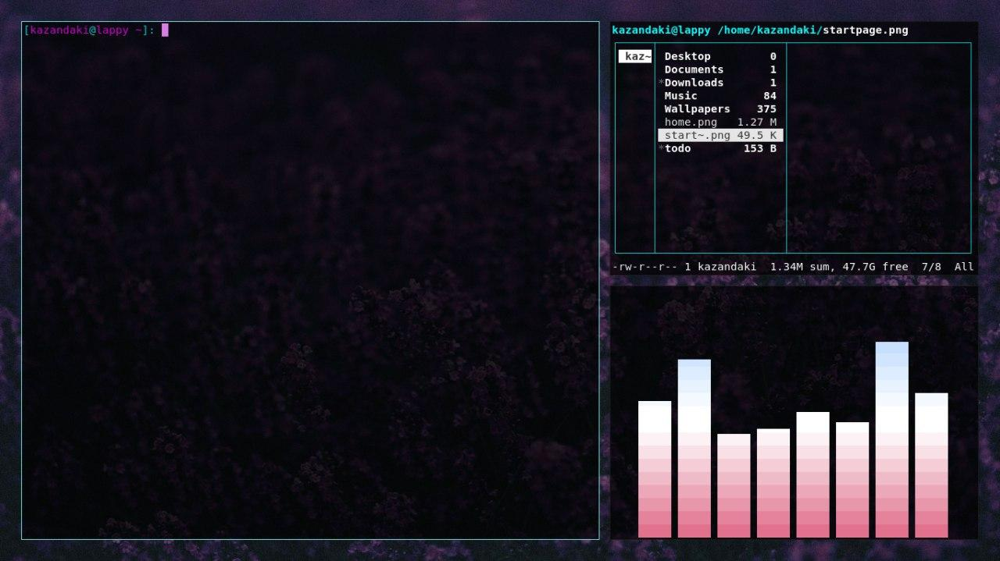

# dotfiles
Dotfiles and extras for my arch rice. This rice uses (or rather has the config files and whatnot for):

* i3-gaps
* urxvt
* cmus
* ranger
* cava
* nano
* dunst
* newsboat
* also has my bashrc file

These files include some scripts as well. These scripts are for convenience and are bound to hotkeys in i3.

* Mod+t will bring up a notification with date/time,
* Mod+b will bring up a notification with battery percentage and status
* Mod+x will bring up a dmenu with logout, shutdown and reboot functions (logout only works if you have a greeter)
* Mod+s will bring up a dmenu with the non-hidden scripts in .config/scripts file
* There's also a startup script that automatically assigns loadouts to certain workspaces and launches the necessary applications etc. as shown below.

Workspace 0 (startpage) (this startpage is hosted  and you can find the repository for it  if you want to customize it or host it yourself, by default this workspace with launch with firefox in fullscreen with whatever is set as your startpage)

Workspace 1 (home)

Workspace 10 (music)

Wallpaper used

## Installation

* Copy the .config, .newsboat folders and the .Xresources file to your home directory.
* Copy the lightdm folder to your /etc directory.
* Add source $HOME/.config/bash/bashrc to your /etch/bash.bashrc
